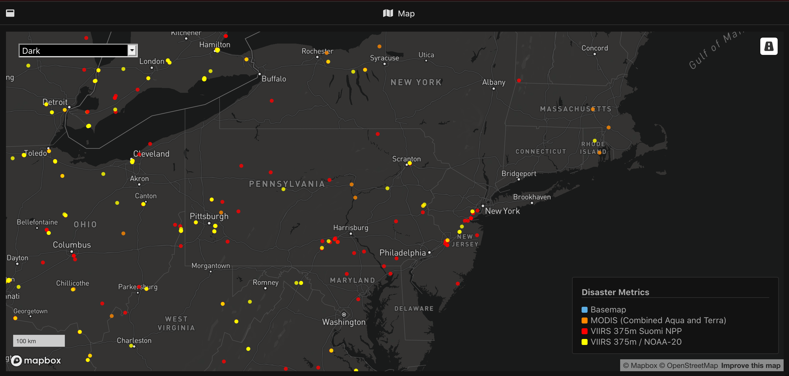
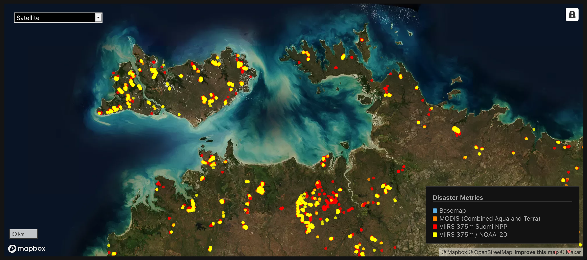

  
  

## NASA FIRMS SCRAPER 

### What is the NASA FIRMS SCRAPER?

A scraper for collecting NASA FIRMS data: near-real time active wildfires (https://firms.modaps.eosdis.nasa.gov/active_fire/#firms-shapefile) and near real-time RAPID fire alerts (https://earthdata.nasa.gov/earth-observation-data/near-real-time/firms).

The scraper collects:
- Active Wildfire data from the latest satellite passes (MODIS, VIIRS SUOMI, VIIRS NOAA-20) on the current day (near real-time)
- Active Wildfire data from the last 24h

